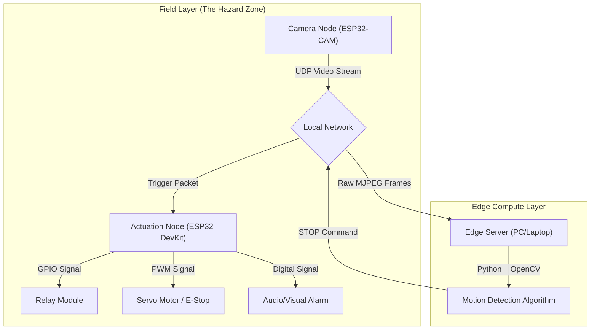

# Virtual Geofence: Distributed Edge-IoT Industrial Safety System


> **A real-time, vision-based emergency interlock system designed to replace physical barriers with intelligent, invisible perimeters.**

---

## Overview

**Virtual Geofence** is a distributed IoT safety system designed to prevent industrial accidents by autonomously halting hazardous machinery when unauthorized human presence is detected. 

[](https://drive.google.com/file/d/1HW1c9g_QqOU_CCa1WTZ2KBgWILmWI6fF/view)

Unlike traditional physical cages or light curtains, this system uses **Computer Vision** and **Edge Computing** to create a dynamic "Virtual Geofence" around dangerous equipment. It achieves **sub-200ms latency** by leveraging a custom UDP streaming protocol and lightweight motion detection algorithms, ensuring immediate actuation before an operator can come into contact with the hazard.

### Key Features
* **Latency-Optimized Networking:** Uses **UDP** over TCP to eliminate handshake overhead, ensuring real-time "freshness" of video data.
* **Distributed Architecture:** Decouples vision processing (Edge Node) from actuation (Microcontroller) for scalability.
* **Fail-Safe Design:** Implements **Active-Low** logic and **Normally Closed (NC)** relays; the machine defaults to "OFF" if power or signal is lost.
* **Robust Detection:** Utilizes **Background Subtraction** and **Gaussian Blurring** to detect any foreign object (hands, tools, torsos) regardless of orientation.

---


## System Architecture

The system follows a **Master-Slave Edge Computing** model:



### 1. The Eye (Vision Node)

* **Hardware:** ESP32-CAM (AI-Thinker)
* **Function:** Captures video at QVGA resolution and streams raw MJPEG chunks via UDP.
* **Optimization:** Frame quality reduced to prioritize transmission speed over fidelity.

### 2. The Brain (Edge Processing)

* **Software:** Python, OpenCV, NumPy.
* **Algorithm:**
1.  **Calibration:** Captures a static "safe" background upon startup.
2.  **Preprocessing:** Applies Gaussian Blur to reduce sensor noise.
3.  **Background Subtraction:** Calculates pixel-wise difference (`cv2.absdiff`).

This illustrates how the system isolates moving objects from a static background before contour detection:

<p align="center">
  
</p>

<p align="center">
  <sub>
    Reference: Analytics Vidhya - Background Subtraction in Computer Vision
  </sub>
</p>

4.  **Thresholding:** Ignores minor lighting changes; triggers only on significant structural changes (motion).
5.  **Decision:** If contour area > threshold, a `STOP` packet is broadcast to the Actuation Node.

### 3. The Muscle (Actuation Node)

* **Hardware:** ESP32 DevKit V1
* **OS:** FreeRTOS (Implicitly leveraged via Arduino framework for dual-core task management).
* **Action:** * **Relay:** Cuts power to the DC Motor (Industrial Load).
* **Servo:** Physically engages the Mechanical Emergency Stop button.
* **Alarm:** Triggers a high-decibel buzzer and LED.

---

## 🛠️ Tech Stack & Hardware

| Category | Components |
| --- | --- |
| **Microcontrollers** | ESP32-CAM, ESP32 DevKit V1 |
| **Languages** | C++ (Firmware), Python (Backend Logic) |
| **Libraries** | OpenCV, NumPy, WiFi.h, WiFiUdp.h, ESP32Servo |
| **Protocols** | UDP (User Datagram Protocol), 802.11 b/g/n (WiFi) |
| **Actuators** | SG90 Servo, 4-Channel Relay Module (5V), DC Motor |
| **Electronics** | Active Buzzer, Red LED, 9V Power Supply, Breadboards |

---

## Getting Started

### Prerequisites

* **Hardware:** All components listed above.
* **Software:** * Arduino IDE (for flashing ESP32s)
* Python 3.x (with `opencv-python` installed)


### Installation

1. **Clone the Repo:**
```bash
git clone [https://github.com/yourusername/Virtual Geofence.git](https://github.com/yourusername/Virtual Geofence.git)

```


2. **Flash the Eye (Camera):**
* Open `ESP32_CAM/ESP32_CAM.ino`.
* Update `ssid` and `password`.
* Set your PC's IP address in `pc_ip`.
* Upload to ESP32-CAM.


3. **Flash the Muscle (Controller):**
* Open `Muscle_Node/Muscle_Node.ino`.
* Update `ssid` and `password`.
* Upload to ESP32 DevKit.


4. **Run the Brain:**
* Update `MUSCLE_IP` in `brain.py` with the IP address printed by the Muscle Node serial monitor.
* Run the script:
```bash
python brain.py

```


---

## Challenges & Solutions

#### **Latency vs. Reliability:**
* *Challenge:* TCP streams introduced 2-3 seconds of lag due to buffering and retransmission.
* *Solution:* Switched to **UDP**. Implemented a "fire-and-forget" protocol where dropped frames are ignored to maintain real-time synchronization (<200ms).


#### **False Positives:**
* *Challenge:* Lighting changes triggered the alarm.
* *Solution:* Implemented **Adaptive Background Learning** (`cv2.accumulateWeighted`) to slowly adjust to ambient light changes without triggering the motion alarm.


#### **Power Management:**
* *Challenge:* Brownouts when the Servo and Motor triggered simultaneously.
* *Solution:* Used separate power source and a relay module.


---

## Future Improvements

* **Migration to C++:** Porting the Python backend to C++ to utilize the Global Interpreter Lock (GIL)-free performance for higher frame rates.
* **Mesh Networking:** Implementing **ESP-MESH** to allow multiple sensor nodes to communicate without a central router.
* **Protocol Upgrade:** Exploring **MQTT** or **DDS** for more robust control signaling in high-noise industrial environments.
